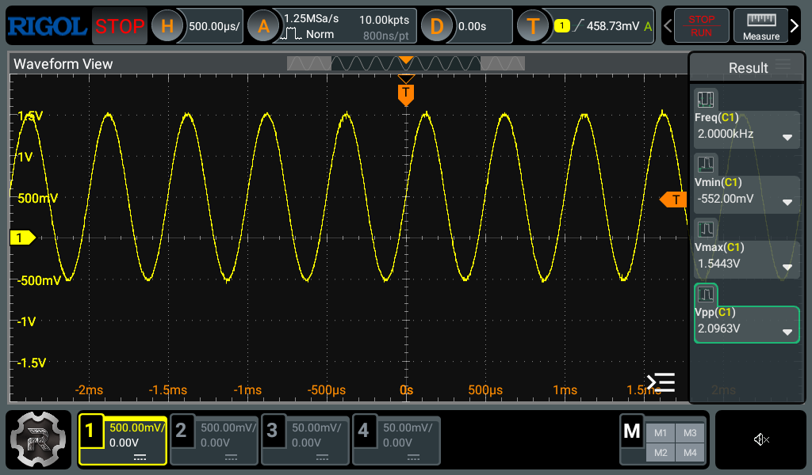
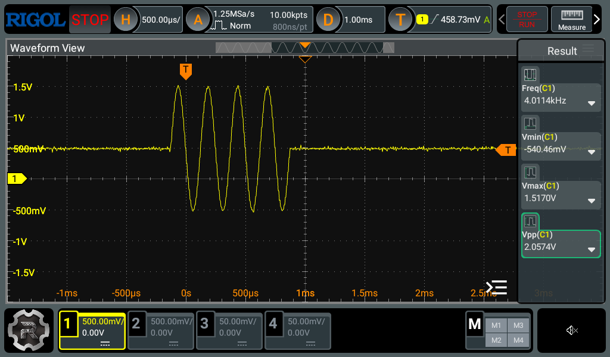
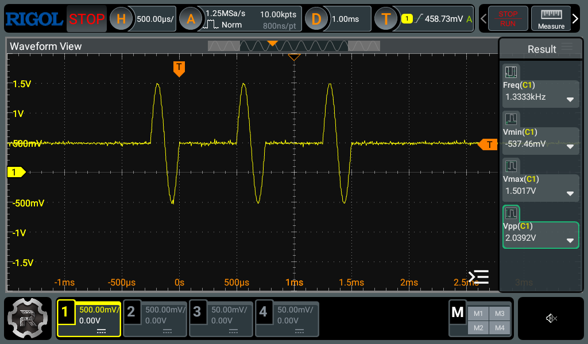
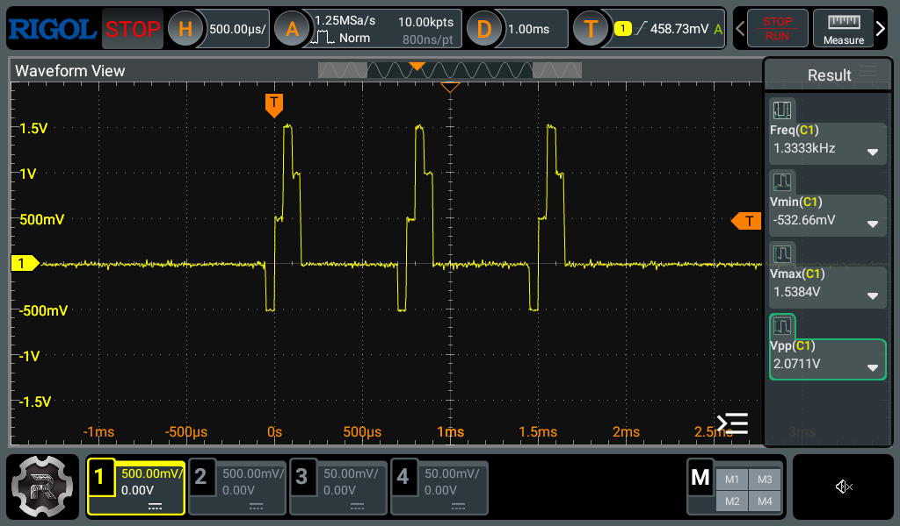
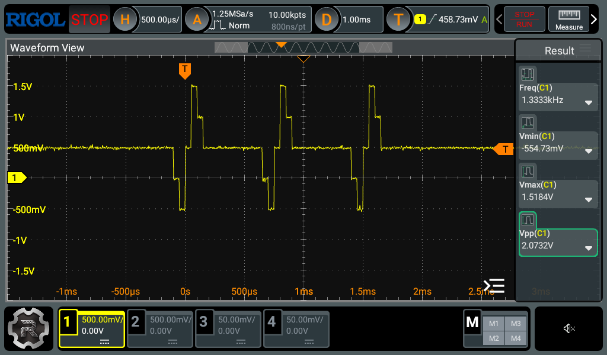
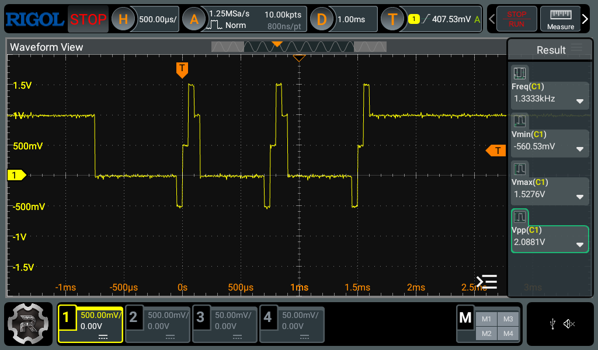
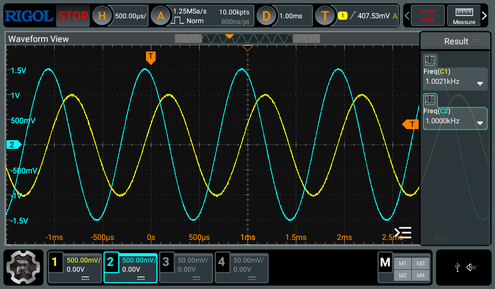
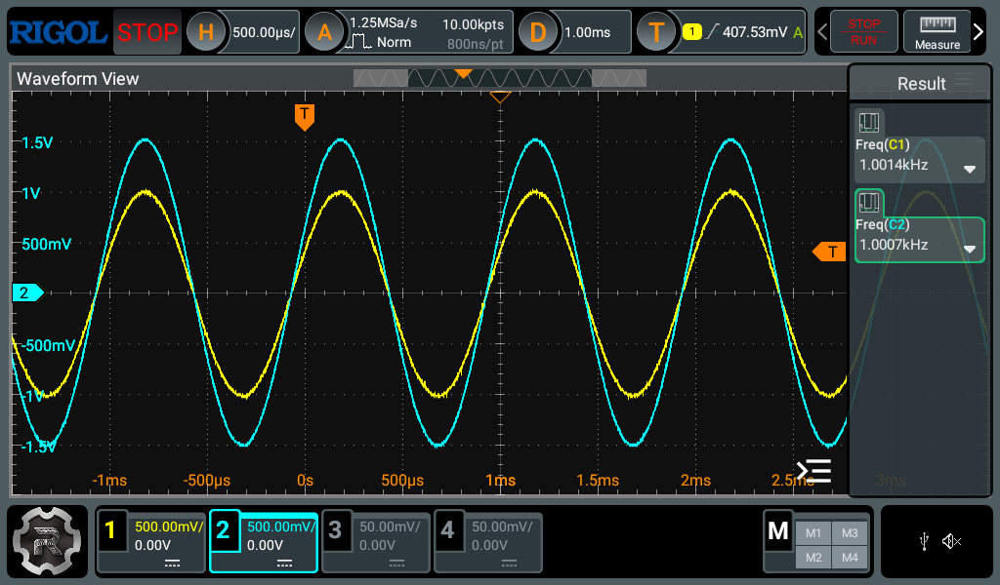

```{r knitr_setup, include = FALSE}
knitr::opts_chunk$set(
  collapse = TRUE,
  comment = "#>",
  fig.align = "center",
  fig.height = 3.5,
  fig.width = 5.5
)
```

```{r session_setup, include = FALSE}
library(dwf4r)
package_info <- paste0("`dwf4r_", utils::packageVersion("dwf4r"), "`")
```

## Experimental setup

The examples in this vignette were recorded using an Analog Discovery 2 NI
Edition and a Rigol DHO804 digital oscilloscope.

The examples and descriptions were checked against WaveForms SDK 3.25 and the
WaveForms SDK Reference Manual revised March 4, 2026.

### Signal generator

The examples were tested using a Digilent Analog Discovery 2 NI Edition.

The device is opened with `OpenDevice()`, used throughout the vignette, and
closed after the final example. Its information is shown below; the serial
number has been masked because it is not relevant to reproducing the examples.

When exactly one device is available, `OpenDevice()` selects it automatically;
if several devices are connected, specify the required device by serial number.

```{r open_device, eval = FALSE}
device <- OpenDevice()

print(device$info)

#> $device_type
#> [1] "Analog Discovery 2"
#> 
#> $device_revision
#> [1] 2051
#> 
#> $device_name
#> [1] "Analog Discovery 2 NI EditionSN:Discovery2NI"
#> 
#> $user_name
#> [1] "Discovery2NI"
#> 
#> $serial_number
#> [1] "SN:************"
#> 
#> $config_count
#> [1] 8
```

### Oscilloscope

The waveforms shown in this vignette were measured using a Rigol DHO804
oscilloscope. The two Analog Out channels were connected to two oscilloscope
inputs, and the Analog Discovery ground terminal was connected to the
corresponding oscilloscope grounds.

For each example, the waveform was generated using the displayed R code, the
oscilloscope settings were adjusted to show the relevant signal properties, and
a screenshot was saved for inclusion in the vignette. The R code is not
evaluated during vignette rendering because it requires connected hardware.

## Generate a sine waveform

The following example generates a continuous 1 kHz sine wave on the first Analog
Out channel.

```{r generate_sine, eval = FALSE}
ResetAnalogOut(device, channel = 0L)
EnableCarrier(device, channel = 0L)
SetCarrier(
  device,
  channel = 0L,
  func = "sine",
  frequency = 1000,
  amplitude = 1,
  offset = 0.5
)
StartAnalogOut(device, channel = 0L)
```

A short sequence of calls is used to prepare and start the output. First,
`ResetAnalogOut()` restores the selected channel to its default configuration,
providing a reproducible starting point. `EnableCarrier()` then enables the
carrier node (the node that generates the principal waveform), while
`SetCarrier()` adds the selected waveform parameters to the pending
configuration. Finally, `StartAnalogOut()` applies the pending configuration and
starts signal generation.

Analog Out setter functions modify a pending configuration rather than applying
each change immediately. The pending settings take effect when
`ApplyAnalogOutSettings()` or `StartAnalogOut()` is called.

The `amplitude` argument specifies the voltage excursion from the offset to
either peak. Consequently, an amplitude of 1 V and an offset of 0.5 V produce an
expected range of approximately -0.5 V to 1.5 V, corresponding to 2 V peak to
peak (Figure 1).

```{r}
#| label: fig_sine_waveform_1000hz
#| echo: false
#| out.width: "100%"
#| fig.cap: >
#|   Figure 1. Oscilloscope trace of the generated 1 kHz sine wave with an
#|   amplitude of 1 V and an offset of 0.5 V. The signal ranges from
#|   approximately -0.5 V to 1.5 V, or 2 V peak to peak.


```

## Modify a running waveform

Analog Out parameters can be changed while a channel is running. The following
code increases the carrier frequency from 1 kHz to 2 kHz and applies the updated
configuration without restarting signal generation (Figure 2).

```{r modify_running_waveform, eval = FALSE}
SetCarrierFrequency(device, channel = 0L, frequency = 2000)
ApplyAnalogOutSettings(device, channel = 0L)
```

Only the frequency is changed; the waveform function, amplitude, offset,
symmetry, and phase retain their previous values. `ApplyAnalogOutSettings()`
updates the configuration while leaving the channel in its running state.

Calling `StartAnalogOut()` on a running channel may produce the same
steady-state waveform, but it explicitly requests that generation start.
`ApplyAnalogOutSettings()` should therefore be used to update a running channel
without intentionally restarting its operation.

```{r}
#| label: fig_sine_waveform_2000hz
#| echo: false
#| out.width: "100%"
#| fig.cap: >
#|   Figure 2. Oscilloscope trace after increasing the carrier frequency from
#|   1 kHz to 2 kHz. The amplitude and offset remain unchanged.


```

Carrier parameters can similarly be updated individually using the dedicated
setter functions:

* `SetCarrierAmplitude()`
* `SetCarrierFrequency()`
* `SetCarrierFunction()`
* `SetCarrierOffset()`
* `SetCarrierPhase()`
* `SetCarrierSymmetry()`

## Inspect and stop waveform generation

The current state of an Analog Out channel can be retrieved using
`GetAnalogOutStatus()`. At this point, the first channel is generating the
modified sine wave and therefore has the `"running"` state.

```{r get_analog_out_status, eval = FALSE}
GetAnalogOutStatus(device, channel = 0L)

#> [1] "running"
```

Waveform generation can be stopped using `StopAnalogOut()`. Stopping the channel
does not reset its configuration; the configured waveform can be started again
using `StartAnalogOut()`.

```{r stop_analog_out, eval = FALSE}
StopAnalogOut(device, channel = 0L)
GetAnalogOutStatus(device, channel = 0L)

#> [1] "ready"
```

The `"ready"` state confirms that the channel is no longer generating the
waveform.

## Generate a finite waveform burst

Analog Out generation proceeds through several instrument states (Figure 3). The
diagram is a simplified adaptation of the state model presented in the Digilent
WaveForms SDK Reference Manual.

```{r}
#| label: fig_analog_out_states
#| echo: false
#| fig.cap: >
#|   Figure 3. Simplified Analog Out state diagram. Solid arrows show the
#|   primary state sequence; dashed arrows show the repeat paths to
#|   <code>&quot;armed&quot;</code> when repeat triggering is enabled and to
#|   <code>&quot;wait&quot;</code> when it is disabled.

local({
  old_par <- par(c("mar", "xpd"))
  on.exit(par(old_par), add = TRUE)
  par(
    mar = c(0.5, 0.5, 0.5, 0.5),
    xpd = NA
  )

  state_x <- c(
    "ready" = 1,
    "armed" = 3,
    "wait" = 5,
    "done" = 1,
    "repeat" = 3,
    "running" = 5
  )
  state_y <- c(
    "ready" = 1,
    "armed" = 1,
    "wait" = 1,
    "done" = 0,
    "repeat" = 0,
    "running" = 0
  )

  box_width <- 1
  box_height <- 0.5

  plot.new()
  plot.window(
    xlim = c(0, 6),
    ylim = c(-0.5, 1.5),
    xaxs = "i",
    yaxs = "i"
  )

  rect(
    xleft = state_x - box_width / 2,
    ybottom = state_y - box_height / 2,
    xright = state_x + box_width / 2,
    ytop = state_y + box_height / 2,
    col = "gray95",
    border = "gray30",
    lwd = 1.5
  )
  
  text(
    x = state_x,
    y = state_y,
    labels = names(state_x)
  )

  arrows(
    x0 = c(
      state_x[["ready"]] + box_width / 2,
      state_x[["armed"]] + box_width / 2,
      state_x[["wait"]],
      state_x[["running"]] - box_width / 2,
      state_x[["repeat"]] - box_width / 2,
      state_x[["repeat"]],
      state_x[["repeat"]] + box_width / 2
    ),
    y0 = c(
      state_y[["ready"]],
      state_y[["armed"]],
      state_y[["wait"]] - box_height / 2,
      state_y[["running"]],
      state_y[["repeat"]],
      state_y[["repeat"]] + box_height / 2,
      state_y[["repeat"]] + box_height / 2
    ),
    x1 = c(
      state_x[["armed"]] - box_width / 2,
      state_x[["wait"]] - box_width / 2,
      state_x[["running"]],
      state_x[["repeat"]] + box_width / 2,
      state_x[["done"]] + box_width / 2,
      state_x[["armed"]],
      state_x[["wait"]] - box_width / 2
      ),
    y1 = c(
      state_y[["armed"]],
      state_y[["wait"]],
      state_y[["running"]] + box_height / 2,
      state_y[["repeat"]],
      state_y[["done"]],
      state_y[["armed"]] - box_height / 2,
      state_y[["wait"]] - box_height / 2
    ),
    length = 0.08,
    lty = c(rep("solid", 5L), rep("dashed", 2L))
  )
  
  text(
    x = c(
      (state_x[["ready"]] + state_x[["armed"]]) / 2,
      (state_x[["armed"]] + state_x[["wait"]]) / 2
    ),
    y = c(state_y[["ready"]], state_y[["armed"]]) + 0.1,
    labels = c("start", "trigger")
  )
})
```

Before generation starts, the channel is in the `"ready"` state. Starting the
channel moves it to `"armed"`. If a trigger source other than `"none"` is
configured, the channel remains armed until a trigger is received; with the
default source of `"none"`, it continues immediately. The channel then waits for
the configured wait time and generates the signal for the configured run time.
If repetitions remain, the wait-run cycle begins again, either automatically or
after a new trigger, depending on the repeat-trigger setting. Otherwise, the
channel enters `"done"`.

By default, the wait time is `0` and the run time is `0`, which requests
continuous generation. Because a continuous run does not finish, the repeat
count is not reached. With a finite run time, the default repeat count of `1L`
performs one wait-run cycle; `0L` requests infinite repetition.

Periodic carrier functions such as `"sine"` define the waveform shape within
each period but do not determine the overall generation duration. The `"custom"`
function similarly repeats a user-defined sequence of samples. In each case, a
finite waveform burst is produced by limiting the Analog Out run time.

For a periodic waveform, the number of cycles in one run interval is the product
of its frequency and run time. The following example increases the carrier
frequency to 4 kHz and sets the run time to four waveform periods, producing a
single four-cycle sine burst.

```{r generate_four_cycle_burst, eval = FALSE}
frequency <- 4000

SetCarrierFrequency(device, channel = 0L, frequency = frequency)
SetAnalogOutRun(device, channel = 0L, run_time = 4L / frequency)
StartAnalogOut(device, channel = 0L)
```

The run time can be updated individually using `SetAnalogOutRun()`, as shown
above. The wait time and repeat count can similarly be updated using
`SetAnalogOutWait()` and `SetAnalogOutRepeat()`, respectively. When several
timing parameters must be changed together, `SetAnalogOutTiming()` provides a
more concise alternative.

At 4 kHz, one waveform period is 0.25 ms, so the configured run time is 1 ms
(Figure 4). The repeat count remains at its default value of `1L`, and the run
interval is therefore performed once.

```{r}
#| label: fig_four_cycle_sine_burst
#| echo: false
#| out.width: "100%"
#| fig.cap: >
#|   Figure 4. Oscilloscope trace of a four-cycle, 4 kHz sine burst generated
#|   during a single 1 ms run interval.


```

The progress of a sufficiently long run interval can be monitored using
`GetAnalogOutRemainingRun()`. The following example starts a one-second run,
waits for 0.1 seconds, and retrieves the remaining run time.

```{r inspect_remaining_run, eval = FALSE}
SetAnalogOutRun(device, channel = 0L, run_time = 1)
StartAnalogOut(device, channel = 0L)
Sys.sleep(0.1)

GetAnalogOutRemainingRun(device, channel = 0L)

#> [1] 0.8868481
```

The returned value is slightly below the theoretical value of 0.9 seconds
because the elapsed time also includes R execution, device communication, and
the status query performed by `GetAnalogOutRemainingRun()`. This function is
therefore most useful for monitoring relatively long run intervals rather than
precise short-duration timing.

Similarly, `GetAnalogOutRemainingRepeat()` retrieves the number of repeat cycles
that have not yet been completed.

```{r inspect_remaining_repeat, eval = FALSE}
SetAnalogOutTiming(
  device,
  channel = 0L,
  run_time = 1 / frequency,
  repeat_count = 1000L
)
StartAnalogOut(device, channel = 0L)
Sys.sleep(0.1)

GetAnalogOutRemainingRepeat(device, channel = 0L)

#> [1] 540
```

In the next example, each run interval lasts for one waveform period and is
preceded by a wait interval lasting two periods. The wait-run cycle is performed
three times.

```{r generate_three_repeated_sine_bursts, eval = FALSE}
SetAnalogOutTiming(
  device,
  channel = 0L,
  run_time = 1 / frequency,
  wait_time = 2 / frequency,
  repeat_count = 3L
)
StartAnalogOut(device, channel = 0L)
```

The earlier call to `ResetAnalogOut()` restored the default repeat-trigger
setting. With repeat triggering disabled, the repeated wait-run cycles proceed
without requiring a new trigger for each cycle. The output therefore consists of
three single-cycle sine bursts, each separated by a 0.5 ms wait interval (Figure
5).

```{r}
#| label: fig_three_repeated_sine_bursts
#| echo: false
#| out.width: "100%"
#| fig.cap: >
#|   Figure 5. Oscilloscope trace of three repeated 4 kHz sine bursts. Each
#|   0.25 ms run interval contains one waveform cycle and is preceded by a
#|   0.5 ms wait interval.


```

## Generate a custom waveform

A custom waveform is specified as a numeric vector containing normalized sample
values between -1 and 1. The vector defines one complete waveform period. This
demonstration uses a five-step waveform with normalized levels of -0.5, -1, 0,
1, and 0.5 (Figure 6).

```{r define_custom_waveform}
waveform <- c(-0.5, -1, 0, 1, 0.5)
```

```{r}
#| label: fig_custom_waveform_profile
#| echo: false
#| fig.cap: >
#|   Figure 6. Normalized profile of the five-step custom waveform. Dashed lines
#|   indicate the levels used by the idle modes:
#|   <code>&quot;initial&quot;</code> outputs the first waveform sample,
#|   <code>&quot;offset&quot;</code> outputs the configured offset (normalized
#|   level 0), and <code>&quot;hold&quot;</code> retains the final waveform
#|   sample after generation finishes.

local({
  old_par <- par(c("mar", "cex"))
  on.exit(par(old_par), add = TRUE)
  
  par(
    mar = c(4.1, 4.1, 1.1, 1.1),
    cex = 0.9
  )
  
  plot(
    seq(from = 0, to = 1, length.out = length(waveform) + 1L),
    c(waveform, waveform[[length(waveform)]]),
    type = "s",
    xlab = "Normalized time",
    ylab = "Normalized level",
    xaxs = "i",
    ylim = c(-1, 1),
    lwd = 2
  )
  
  idle_levels <- c(waveform[[1L]], 0, waveform[[length(waveform)]])
  idle_labels <- c("initial", "offset", "hold")
  abline(
    h = idle_levels,
    col = "gray70",
    lty = "dashed"
  )
  text(
    x = 0.05,
    y = idle_levels + 0.05,
    labels = idle_labels,
    adj = c(0, 0),
    col = "gray40"
  )
})
```

`SetCarrierData()` uploads the normalized sample vector to the carrier node. The
`"custom"` carrier function must also be selected before generation starts. The
frequency, amplitude, and offset retain their previously configured values of 4
kHz, 1 V, and 0.5 V, respectively.

```{r generate_custom_waveform, eval = FALSE}
SetCarrierFunction(device, channel = 0L, func = "custom")
SetCarrierData(device, channel = 0L, data = waveform)
StartAnalogOut(device, channel = 0L)
```

The SDK converts each normalized sample to an output voltage according to:
$$
V_{\mathrm{out}} = \mathrm{offset} + \mathrm{sample} \times \mathrm{amplitude}
$$.

The normalized custom waveform spans from -1 to 1, as does the normalized sine
waveform used earlier. The offset is therefore the waveform midpoint, and the
amplitude is the voltage excursion from that midpoint to either extreme. An
amplitude of 1 V and an offset of 0.5 V produce an overall range from -0.5 V to
1.5 V, corresponding to 2 V peak to peak.

The five normalized samples produce output levels of 0 V, -0.5 V, 0.5 V, 1.5 V,
and 1 V. At 4 kHz, the complete sequence has a period of 0.25 ms.

The timing configuration from the preceding example remains active. Each run
interval therefore generates one complete custom waveform, and the sequence is
repeated three times with a 0.5 ms wait interval before each run (Figure 7).

```{r}
#| label: fig_custom_waveform
#| echo: false
#| out.width: "100%"
#| fig.cap: >
#|   Figure 7. Oscilloscope trace of the five-step custom waveform. Each
#|   0.25 ms run interval contains normalized levels of -0.5, -1, 0, 1, and
#|   0.5, corresponding to 0 V, -0.5 V, 0.5 V, 1.5 V, and 1 V.


```

## Control idle output

The idle mode controls the channel output while waveform generation is inactive,
including the `"ready"`, `"wait"`, and `"done"` states and after generation is
stopped. After the channel is reset, the Analog Discovery 2 uses `"initial"` as
its default idle mode. This mode outputs the initial value of the configured
waveform.

For the custom waveform, the initial normalized sample is -0.5. With an
amplitude of 1 V and an offset of 0.5 V, the default idle voltage is therefore 0
V (Figure 7).

The `"offset"` mode instead uses the configured offset as the idle voltage. The
following code sets the idle output to 0.5 V and starts the three-cycle wait-run
sequence again (Figure 8).

```{r use_offset_idle_output, eval = FALSE}
SetAnalogOutIdle(device, channel = 0L, idle = "offset")
StartAnalogOut(device, channel = 0L)
```

```{r}
#| label: fig_offset_idle_output
#| echo: false
#| out.width: "100%"
#| fig.cap: >
#|   Figure 8. Custom waveform generated with the
#|   <code>&quot;offset&quot;</code> idle mode. The output remains at the
#|   configured offset of 0.5 V during the wait intervals and after generation
#|   finishes.


```

The `"hold"` mode uses the initial waveform level before and between run
intervals but retains the final waveform level after generation finishes. For
the current waveform, the idle voltage during each wait interval would therefore
be 0 V. The final normalized sample is 0.5, corresponding to a held output of 1
V in the `"done"` state (Figure 9).

```{r use_hold_idle_output, eval = FALSE}
SetAnalogOutIdle(device, channel = 0L, idle = "hold")
StartAnalogOut(device, channel = 0L)
```

```{r}
#| label: fig_hold_idle_output
#| echo: false
#| out.width: "100%"
#| fig.cap: >
#|   Figure 9. Custom waveform generated with the <code>&quot;hold&quot;</code>
#|   idle mode. The output uses the initial waveform level of 0 V before and
#|   between run intervals, then retains the final waveform level of 1 V after
#|   generation finishes.


```

## Inspect capabilities and configured values

Analog Out capabilities depend on the connected device and its selected
configuration. Before setting a parameter, `dwf4r` obtains the supported range
from the WaveForms SDK and checks the requested value against that range. A
value outside the reported range is rejected before the corresponding setter is
called.

A value within the supported range is not necessarily represented exactly by the
device. Getter functions can therefore be used to retrieve the value actually
configured by the SDK. For example, the carrier frequency requested in the
preceding examples was 4000 Hz.

```{r inspect_configured_frequency, eval = FALSE}
GetCarrierFrequency(device, channel = 0L) - frequency

#> [1] 0.0001899898
```

The configured frequency is approximately 0.00019 Hz higher than the requested
frequency. This small difference reflects the frequency representation available
to the device. It does not describe the accuracy of the physical output, which
must be determined independently by measurement.

The following functions retrieve general Analog Out capabilities:

* `GetAnalogOutChannelCount()`
* `GetAnalogOutChannelNodes()`
* `GetAnalogOutIdleModes()`
* `GetAnalogOutRepeatRange()`
* `GetAnalogOutRunRange()`
* `GetAnalogOutWaitRange()`

The following functions retrieve capabilities of a selected Analog Out node:

* `GetAnalogOutNodeAmplitudeRange()`
* `GetAnalogOutNodeFrequencyRange()`
* `GetAnalogOutNodeFunctionTypes()`
* `GetAnalogOutNodeOffsetRange()`
* `GetAnalogOutNodePhaseRange()`
* `GetAnalogOutNodeSampleCountRange()`
* `GetAnalogOutNodeSymmetryRange()`

The current carrier configuration can be inspected using:

* `IsCarrierEnabled()`
* `GetCarrierAmplitude()`
* `GetCarrierFrequency()`
* `GetCarrierFunction()`
* `GetCarrierOffset()`
* `GetCarrierPhase()`
* `GetCarrierSettings()` (it retrieves all carrier parameters together as a
  named list)
* `GetCarrierSymmetry()`

The channel-level Analog Out configuration can be inspected using:

* `GetAnalogOutIdle()`
* `GetAnalogOutMaster()`
* `GetAnalogOutRepeat()`
* `GetAnalogOutRun()`
* `GetAnalogOutTiming()` (it retrieves the run time, wait time, and repeat count
  together as a named list)
* `GetAnalogOutWait()`

The current Analog Out state and remaining timing values can be inspected using:

* `GetAnalogOutStatus()`
* `GetAnalogOutRemainingRepeat()`
* `GetAnalogOutRemainingRun()`

## Run two channels independently

Analog Discovery 2 has two Analog Out channels. Both channels can generate
signals independently. The following example resets the channels and configures
two 1 kHz sine waves. Both have an offset of 0 V and a phase of 0°, while their
amplitudes are 1 V and 1.5 V.

```{r configure_independent_channels, eval = FALSE}
ResetAnalogOut(device, channel = 0L)
ResetAnalogOut(device, channel = 1L)

EnableCarrier(device, channel = 0L)
EnableCarrier(device, channel = 1L)

SetCarrier(
  device,
  channel = 0L,
  func = "sine",
  frequency = 1000,
  amplitude = 1,
  offset = 0,
  phase = 0
)
SetCarrier(
  device,
  channel = 1L,
  func = "sine",
  frequency = 1000,
  amplitude = 1.5,
  offset = 0,
  phase = 0
)

StartAnalogOut(device, channel = 0L)
StartAnalogOut(device, channel = 1L)
```

Although both waveforms have a configured phase of 0°, they are shifted relative
to each other because the channels are started independently (Figure 10). The
shift remains stable during an individual run but changes each time the code is
executed, so the initial phase relationship is not reproducible.

```{r}
#| label: fig_independent_analog_out_channels
#| echo: false
#| out.width: "100%"
#| fig.cap: >
#|   Figure 10. Independently started 1 kHz sine waves from Analog Out channels
#|   0 and 1, with amplitudes of 1 V and 1.5 V, respectively. Although both
#|   signals have a configured phase of 0°, they exhibit an uncontrolled
#|   relative phase shift. The shift remains stable during the displayed run but
#|   changes when the channels are independently restarted.


```

## Synchronize Analog Out channels

Analog Out channels can be synchronized by assigning one channel as the
state-machine master of another. The slave retains its own carrier configuration
but follows the master's trigger, wait, run, and repeat sequence. In this
example, channel 0 becomes the master of channel 1.

```{r synchronize_analog_out_channels, eval = FALSE}
StopAnalogOut(device, channel = 0L)
StopAnalogOut(device, channel = 1L)

SetAnalogOutMaster(
  device,
  channel = 1L,
  master_channel = 0L
)

ApplyAnalogOutSettings(device, channel = 1L)
StartAnalogOut(device, channel = 0L)
```

The slave configuration must be applied before the master is started.
`ApplyAnalogOutSettings()` applies the master assignment while leaving the slave
stopped. `StartAnalogOut()` then starts channel 0 and its configured slave as a
synchronized group, producing a reproducible relative phase (Figure 11).

```{r}
#| label: fig_synchronized_analog_out_channels
#| echo: false
#| out.width: "100%"
#| fig.cap: >
#|   Figure 11. Synchronized 1 kHz sine waves from Analog Out channels 0 and 1,
#|   with amplitudes of 1 V and 1.5 V, respectively. Both signals have an
#|   offset of 0 V and a configured phase of 0°. Because the channels are
#|   synchronized and both carriers have the same frequency, their zero
#|   crossings and corresponding extrema coincide.


```

`GetAnalogOutMaster()` retrieves the state-machine master assigned to a channel.
In the current configuration, it returns `0L` for both channels. For channel 0,
this means that the channel is its own master. For channel 1, it means that the
channel follows the state machine of channel 0.

```{r inspect_analog_out_masters, eval = FALSE}
GetAnalogOutMaster(device, channel = 0L)

#> [1] 0

GetAnalogOutMaster(device, channel = 1L)

#> [1] 0
```

## Stop generation and close the device

At the end of the session, generation is stopped and the device handle is
closed. Because channel 0 is the state-machine master, stopping it also stops
its synchronized slave. `CloseDevice()` then releases the device and discards
its current configuration.

```{r close_device, eval = FALSE}
StopAnalogOut(device, channel = 0L)
CloseDevice(device)
```


---

Built with `r package_info`.
